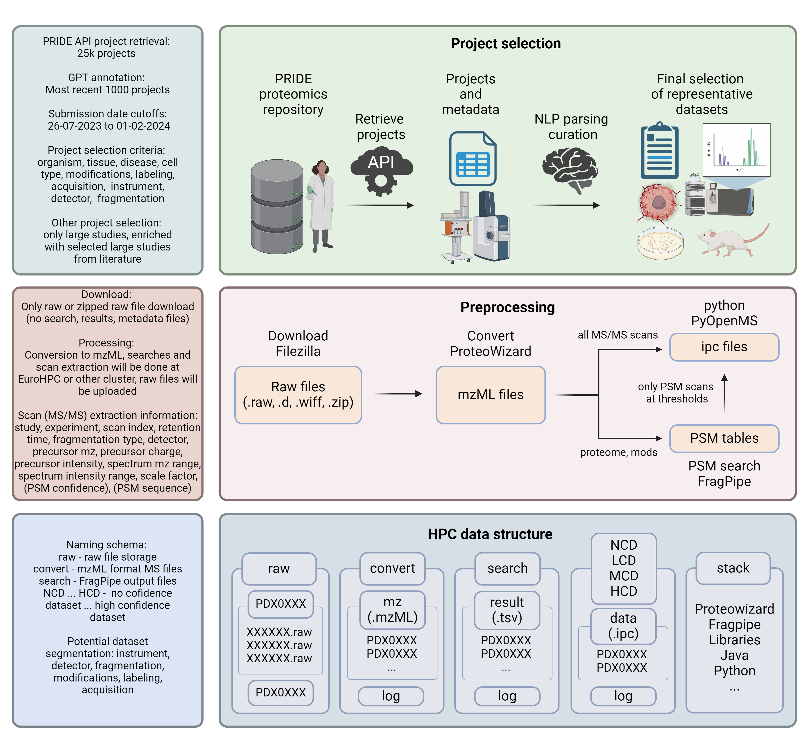

# Mass Spectrometry Foundation Model


## Graphical abstract




## Usage

### Create virtual environment

```bash
make create_venv
```

### Activate virtual environment

```bash
make activate
```

### Install required packages

```bash
make install
```


## Developer Usage

### Install required and development packages

```bash
make install-dev
```

### Adding a new package or updating pinned requirements

Add a new unpinned package to `requirements/requirements.in` (or a new development package to `requirements/requirements-dev.in`)

```bash
make compile
```

This will generate the `requirements/requirements*.txt` files with pinned package dependencies.


## Project Structure Overview

```
├── data
│   ├── 1_raw                       # immutable original data
│   ├── 2_convert                   # mzML format MS files
│   ├── 3_search                    # FragPipe output files
│   ├── 4_confidence
│   │   ├── 1_no                    # no confidence dataset
│   │   ├── 2_low                   # low confidence dataset
│   │   ├── 3_medium                # medium confidence dataset
│   │   └── 4_high                  # high confidence dataset
│   └── 5_predictions
├── requirements                    # package dependencies
├── scripts                         # commands to train, evaluate, and produce the plots in the paper
├── src
│   ├── etl                         # logic for cleaning the data and preparing train / test set
│   └── model                       # logic for ML model including CV, parameter tuning, model evaluation
└── tests                           # unit tests
```
